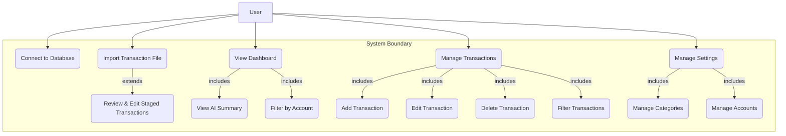

# 2. Requirements Engineering

This section details the functional and non-functional requirements of the Financial AI Manager, as well as key user interactions and use cases.

---

### 2.1 Functional Requirements

| ID   | Requirement                                                                      | Description                                                                                                                                        |
| ---- | -------------------------------------------------------------------------------- | -------------------------------------------------------------------------------------------------------------------------------------------------- |
| FR-1 | **Data Ingestion: Database Connection**                                          | The user shall be able to initiate the application by connecting to a pre-populated, in-memory database of transactions, accounts, and categories.      |
| FR-2 | **Data Ingestion: File Upload**                                                  | The user shall be able to upload a transaction history file in either `.csv` or `.xlsx` format.                                                      |
| FR-3 | **File Parsing & Staging**                                                       | The system shall parse the uploaded file and display the transactions in a staging area where the user can review, edit, add, or delete them.      |
| FR-4 | **Selective Import**                                                             | The user shall be able to select which staged transactions they wish to save to the database.                                                      |
| FR-5 | **Dashboard View**                                                               | The user shall be able to view a dashboard summarizing their financial health, including total income, total expenses, and net savings.            |
| FR-6 | **AI-Powered Summary**                                                           | The system shall generate and display an AI-powered analysis of the user's finances, including an overall summary and actionable insights.         |
| FR-7 | **Data Visualization**                                                           | The dashboard shall include a bar chart for monthly income vs. expenses and a pie chart for expense breakdown by category.                         |
| FR-8 | **Account Filtering**                                                            | The user shall be able to filter the dashboard view by a specific financial account or view all accounts combined.                                 |
| FR-9 | **Transaction Management (CRUD)**                                                | The user shall be able to create, view, update, and delete individual transactions.                                                                |
| FR-10| **Advanced Transaction Filtering**                                               | The user shall be able to filter the transaction list by description (search), type (income/expense), category, and a specified date range.        |
| FR-11| **Account & Category Management (CRUD)**                                         | The user shall be able to create, rename, and delete their custom financial accounts and spending categories via a dedicated settings page.            |
| FR-12| **Application Reset**                                                            | The user shall be able to reset the application, clearing all transaction data and returning to the initial onboarding state.                    |

---

### 2.2 Non-Functional Requirements

| ID    | Requirement          | Description                                                                                                                                                                  |
| ----- | -------------------- | ---------------------------------------------------------------------------------------------------------------------------------------------------------------------------- |
| NFR-1 | **Usability**        | The application must have a clean, intuitive, and responsive user interface that is easy to navigate on both desktop and modern mobile devices. All primary actions should be discoverable with minimal guidance. |
| NFR-2 | **Security**         | The Google Gemini API key and all database credentials must be stored securely on the backend and must never be exposed to the client-side application. Communication between client and server should be secure (HTTPS in production). |
| NFR-3 | **Performance**      | Page loads and data-fetching operations should complete within 2 seconds under typical load. AI summary generation should complete within 10 seconds. The UI must display loading indicators during all asynchronous operations. |
| NFR-4 | **Maintainability**  | The codebase must be well-structured, typed (using TypeScript), and adhere to defined linting and formatting rules to ensure it is easy to understand, modify, and extend. |
| NFR-5 | **Reliability**      | The application should handle errors gracefully. API or database connection failures must display a clear error message to the user without crashing the application. |
| NFR-6 | **Compatibility**    | The frontend application must be compatible with the latest two major versions of all modern web browsers (Chrome, Firefox, Safari, Edge).                                    |

---

### 2.3 User Interaction and Use Cases

#### 2.3.1 User Roles and Permissions

The application currently has a single user role:
-   **User:** Has full access to all data and functionality within their session. There is no multi-user or administrative distinction.

#### 2.3.2 Key User Journeys

1.  **Onboarding & Analysis (Database):**
    -   User lands on the welcome page.
    -   User clicks "Connect to Database".
    -   Application loads mock data and navigates to the Dashboard.
    -   User views the AI summary and interactive charts.

2.  **Onboarding & Analysis (File Upload):**
    -   User lands on the welcome page.
    -   User selects the "Import File" tab and uploads a `.csv` file.
    -   Application parses the file and navigates to the Import page.
    -   User reviews the staged transactions, edits a category for one transaction, and deselects another.
    -   User clicks "Save Selected to Database".
    -   Application saves the data and navigates to the Dashboard.

3.  **Transaction & Settings Management:**
    -   User navigates to the "Transactions" page.
    -   User filters transactions to see all "Groceries" expenses from the last month.
    -   User edits a transaction to correct the amount.
    -   User navigates to the "Settings" page.
    -   User adds a new category called "Subscriptions".
    -   User returns to the "Transactions" page and re-categorizes an old transaction to "Subscriptions".

#### 2.3.3 Use Case Diagram

