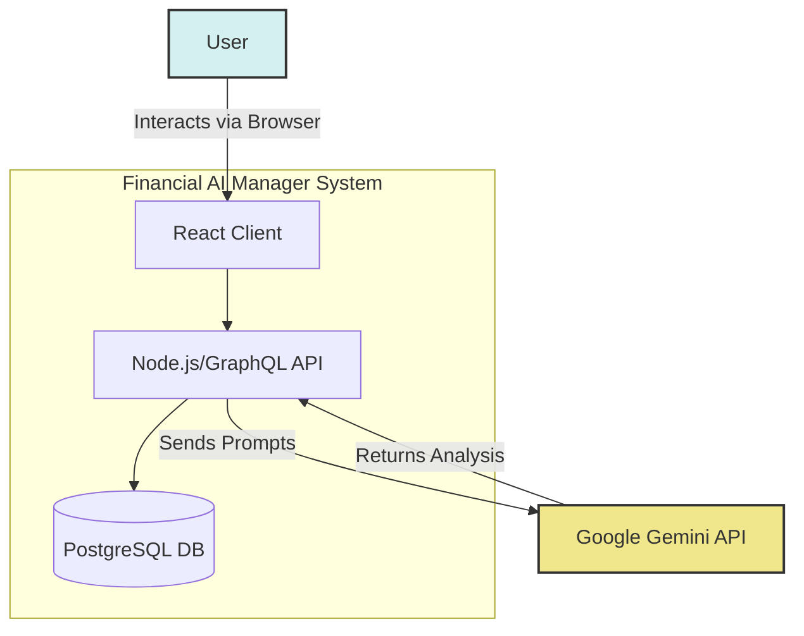
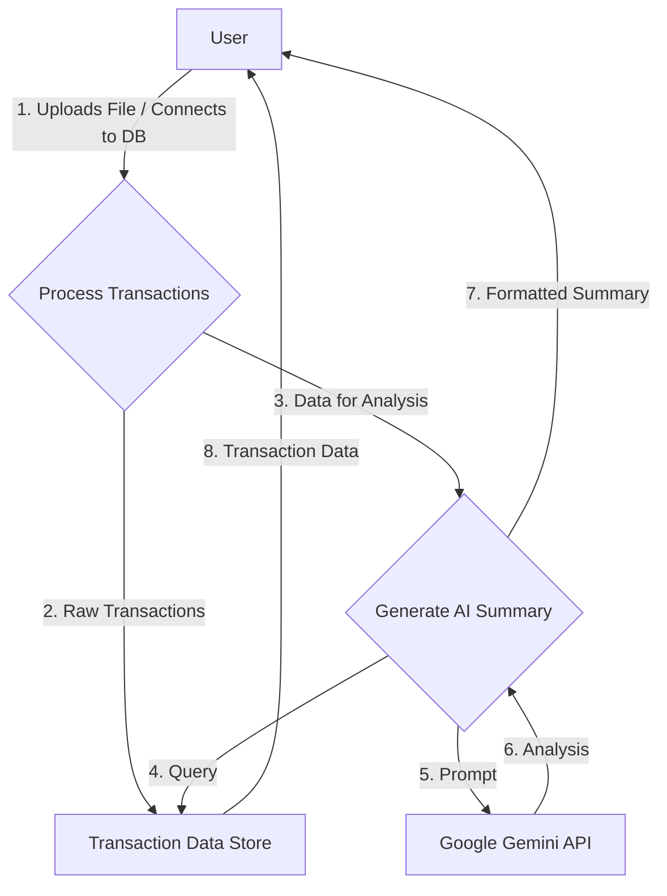
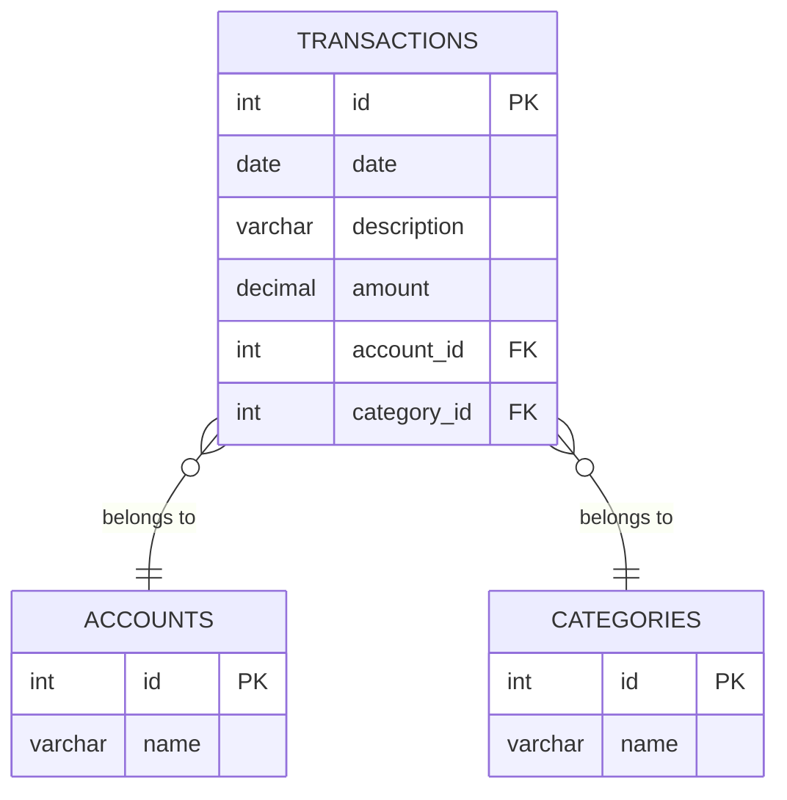

# 3. Software Design

This section provides a detailed overview of the application's architecture, database schema, and API design.

---

### 3.1 Architectural Design

#### 3.1.1 Chosen Architectural Patterns and Rationale

-   **Pattern:** Client-Server Architecture.
-   **Rationale:** This is a standard and effective pattern for web applications. It cleanly separates the user interface (client) from the business logic and data persistence (server), allowing them to be developed, deployed, and scaled independently.
-   **Pattern:** Monolithic Backend (within a Monorepo).
-   **Rationale:** For the current scope of the application, a single, unified backend service is simpler to develop, test, and deploy than a microservices architecture. The monorepo structure (using Yarn Workspaces) keeps the client and server codebases co-located, simplifying dependency management and cross-package development.

#### 3.1.2 System Context Diagram

This diagram shows how the Financial AI Manager system interacts with its users and external systems.



#### 3.1.3 High-Level Component Diagram

This diagram illustrates the major components of the frontend and backend and their interactions.

```mermaid
graph TD
    subgraph "Browser (Client)"
        direction TB
        App[App.tsx]
        Router[Page Router]
        ApolloClient[Apollo Client]
        Components[UI Components]
        Pages[Page Components]

        App --> Router;
        Router --> Pages;
        Pages --> Components;
        Pages -- Uses --> ApolloClient;
    end

    subgraph "Server"
        direction TB
        ApolloServer[Apollo Server]
        Resolvers[GraphQL Resolvers]
        Services[Service Layer]
        DBClient[DB Client (pg)]
        GeminiService[Gemini Service]
        
        ApolloServer --> Resolvers;
        Resolvers --> Services;
        Services --> DBClient;
        Services --> GeminiService;
    end
    
    ApolloClient -- GraphQL over HTTP --> ApolloServer;
    DBClient -- SQL --> DB[(PostgreSQL)];
    GeminiService -- REST API --> Ext_Gemini[Google Gemini API];

```

#### 3.1.4 Data Flow Diagram (DFD) - Level 0

This DFD shows the primary flow of data when a user analyzes their transactions.



#### 3.1.5 Security, Scalability, and Performance

-   **Security:**
    -   Sensitive credentials (database connection string, Gemini API key) are managed server-side and are never exposed to the client.
    -   For production deployment on GCP, these credentials are stored securely using Google Secret Manager.
    -   The connection between the Cloud Run service and Cloud SQL database occurs over a secure, private Google network.
-   **Scalability:**
    -   The backend is deployed on Cloud Run, a serverless platform that automatically scales the number of container instances based on incoming traffic. This provides horizontal scalability.
    -   The database is on Cloud SQL, which can be scaled vertically (by increasing CPU/RAM) with minimal downtime.
-   **Performance:**
    -   The frontend is a static build hosted on Cloud Storage, which is highly performant for serving static assets.
    -   GraphQL allows the client to request only the data it needs, reducing payload size.
    -   The backend database client (`pg`) uses a connection pool to efficiently manage database connections.

---

### 3.2 Database Design

#### 3.2.1 Entity-Relationship (ER) Diagram



#### 3.2.2 Schema Definition (SQL DDL)

This is the SQL code used to create the database schema.

```sql
-- Drop tables if they exist to ensure a clean slate
DROP TABLE IF EXISTS transactions;
DROP TABLE IF EXISTS categories;
DROP TABLE IF EXISTS accounts;

-- Create the accounts table
CREATE TABLE accounts (
    id SERIAL PRIMARY KEY,
    name VARCHAR(255) UNIQUE NOT NULL
);

-- Create the categories table
CREATE TABLE categories (
    id SERIAL PRIMARY KEY,
    name VARCHAR(255) UNIQUE NOT NULL
);

-- Create the transactions table with foreign key constraints
CREATE TABLE transactions (
    id SERIAL PRIMARY KEY,
    date DATE NOT NULL,
    description VARCHAR(255) NOT NULL,
    amount NUMERIC(12, 2) NOT NULL,
    account_id INTEGER,
    category_id INTEGER,
    CONSTRAINT fk_account
        FOREIGN KEY(account_id) 
        REFERENCES accounts(id)
        ON DELETE SET NULL, -- If an account is deleted, set account_id to NULL
    CONSTRAINT fk_category
        FOREIGN KEY(category_id)
        REFERENCES categories(id)
        ON DELETE SET NULL -- If a category is deleted, set category_id to NULL
);

-- Create indexes for performance
CREATE INDEX idx_transactions_date ON transactions(date);
CREATE INDEX idx_transactions_account_id ON transactions(account_id);
CREATE INDEX idx_transactions_category_id ON transactions(category_id);
```

---

### 3.3 API Design

The application uses a GraphQL API. The complete schema defines all available queries (for reading data) and mutations (for writing data).

**Key Types:**
-   `Transaction`: Represents a single financial event.
-   `Account`: Represents a financial account (e.g., Checking).
-   `Category`: Represents a spending category (e.g., Groceries).
-   `AiSummary`: The structured response from the Gemini API.

**Key Queries:**
-   `transactions`: Fetches all transactions.
-   `accounts`: Fetches all accounts.
-   `categories`: Fetches all categories.
-   `aiSummary`: Fetches the AI-generated financial analysis.

**Key Mutations:**
-   `addTransaction`, `updateTransaction`, `deleteTransaction`: Standard CRUD for transactions.
-   `addAccount`, `updateAccount`, `deleteAccount`: CRUD for accounts.
-   `addCategory`, `updateCategory`, `deleteCategory`: CRUD for categories.
-   `saveTransactions`: A bulk mutation to save staged transactions from a file import.
-   `suggestCategories`: An AI-powered mutation to suggest categories for a list of transactions.

The full schema is defined in `packages/server/src/graphql/schema.ts`.

---

### 3.4 UI/UX Design Principles

-   **Clarity and Simplicity:** The UI prioritizes a clean, uncluttered layout. Key information is presented upfront, and complex actions are handled within modals to maintain context.
-   **Consistency:** A consistent color palette, typography, and component design are used throughout the application to create a cohesive user experience.
-   **Feedback:** The application provides immediate feedback for user actions. Loading spinners, disabled buttons, and clear error messages inform the user of the system's state.
-   **Responsiveness:** The layout adapts to different screen sizes, ensuring a functional and aesthetically pleasing experience on both desktop and mobile devices.
